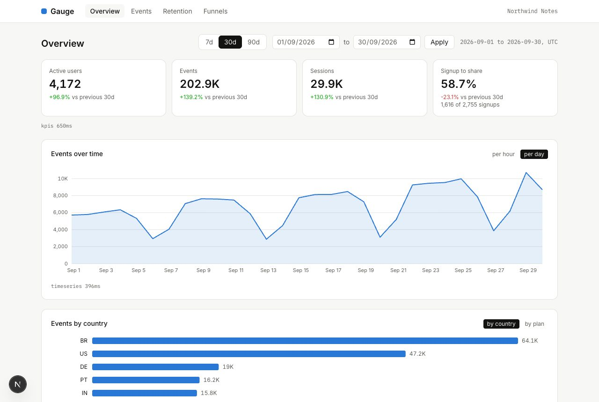

<p align="center">
  
</p>

<h1 align="center">Gauge</h1>

<p align="center">
  Product analytics for a small SaaS, with the math in the database.<br>
  <sub>Next.js 16 · React 19 · TypeScript · Postgres · Prisma 7 · d3-scale, no chart library</sub>
</p>

<br>

Northwind Notes is a made-up note-taking product with five thousand users and
three hundred thousand events over the last ninety days. Gauge is the
dashboard its team would open on a Monday: how many people were active, what
they did, which signup cohorts came back, and where the funnel leaks.

I built it to work the way real analytics tools have to: every aggregate is
one SQL query over an index, every filter is in the URL so a view can be
pasted into a chat, the charts are SVG I drew myself, and the events table
scrolls through a hundred thousand rows without loading them.



## Running it

Node 24, and there is an `.nvmrc`.

```bash
nvm use
npm install

npm run db:dev          # local Postgres, no Docker. Prints a postgres:// URL.
cp .env.example .env    # paste the URL in
npm run db:migrate
npm run db:seed         # about twenty seconds for 300k rows
npm run dev
```

The seed is deterministic, so the numbers on your screen are the numbers in
the screenshots. Any hosted Postgres works instead of `db:dev`.

| Command             |                                                                   |
| ------------------- | ----------------------------------------------------------------- |
| `npm run dev`       | dev server, with each widget's query time under it                |
| `npm test`          | the suite; the database tests run only when `DATABASE_URL` is set |
| `npm run typecheck` | `tsc --noEmit`                                                    |
| `npm run db:reset`  | drop, migrate, reseed                                             |

## How the queries work

Everything lives in `src/lib/queries/` as tagged-template SQL through
`prisma.$queryRaw`. Values are always bound parameters; the only fragments
composed at runtime are column choices and CTE aliases the code picks itself.

**Overview.** Counts over `events` for the range, and the same counts for
the previous period of the same length, so every tile can say "+12% vs
previous 30d". The time series uses `generate_series` for the buckets and a
left join for the counts, which is what makes a quiet day show as zero
instead of disappearing. Hour buckets kick in automatically for ranges up to
three days; the toggle overrides it.

**Explorer.** Filters compose as `AND`ed fragments: `name IN (...)`,
`plan IN (...)`, and `props @> '{"channel":"link"}'::jsonb` for anything
typed as `key=value`. Pages are keyset-paginated on `(ts, id)` descending,
so page fifty costs the same as page one, and a row inserted meanwhile
cannot shift the others. The count is capped at a hundred thousand: past
that the number is a "100K+" and the scan stops.

**Retention.** One CTE for the cohorts (signup week, Monday UTC), one for
`DISTINCT (user, week)` activity joined on `(user_id, ts)`, then a group by
cohort and weeks-since. Shaping that into a triangle with nulls for weeks
that have not happened yet is done in TypeScript, where it is testable.

**Funnels.** Step _n_ is a CTE joined to step _n-1_ on `user_id` with
`e.ts > previous.ts`, so a user counts only if the events happened in
order. Names are parameters; only the aliases `s0…s5` are literal.

What Postgres does with them, on the seeded data (`EXPLAIN ANALYZE`, 30 days):

```
kpis         Index Scan using events_user_id_ts_idx, 204k rows, 138 ms
timeseries   Seq Scan + HashAggregate into 31 buckets, 62 ms
explorer     Index Scan Backward on events_ts_idx, stops after 101 rows, 0.9 ms
conversion   Seq Scan on users + Bitmap Index Scan on (user_id, ts) per user, 33 ms
```

The KPI query is the slow one: three distinct counts over two hundred
thousand rows. A real deployment would keep a daily rollup table; here the
whole thing fits in memory and 138 ms is fine for a dashboard.

## Things worth opening

**`src/lib/params.ts`.** Every URL parameter parsed in one place with zod: date
range and presets, bucket, breakdown, explorer filters, cursor, funnel steps.
A bad value falls back instead of breaking the page, so a hand-edited link
still opens. `withParams` builds the next link from the current ones, which
is how the toggles and presets work without any client state.

**`src/components/charts/line-chart.tsx`.** The tooltip follows the pointer
through `bisector`, and the arrow keys move it point by point when the SVG has
focus. Under it is a visually hidden table with the same numbers, and the SVG
has a title and a description, so a screen reader gets the total and the
range before the shape.

**`src/components/charts/heatmap.tsx`.** The retention grid is a `<table>`,
with the percentage written in every cell. Color is a second reading of the
number, not the only one; the ramp is one hue, light to dark.

**`src/components/explorer/events-table.tsx`.** TanStack Virtual for the
rows, a keyset cursor for the pages, one request in flight at a time tracked
in a ref rather than cancelled in an effect cleanup, because the effect
re-runs on every scroll and cancelling would drop a page that was already on
its way. Found that one the hard way.

**`src/app/api/events/export/route.ts`.** The CSV export is a
`ReadableStream` that pulls a thousand rows at a time through the same query,
so the download starts immediately and the server never holds the whole
result.

**`src/lib/seed/generate.ts`.** A seeded PRNG and a small model of how people
use a product: signups that ramp up, daytime peaks in each user's zone,
weekends at a third of weekday traffic, a funnel that leaks at every step,
paying plans that stick around. It is what makes the charts look like data
instead of noise.

## Tests

```bash
npm test
```

37 tests without a database: the parameter parsing (every fallback), the
retention and funnel shaping, CSV escaping, the seed's invariants (every
event after its user's signup, the funnel leaks, weekends are quieter), and
the charts as rendered components: empty states, the hidden tables, the
keyboard tooltip. Five more run against the seeded database when
`DATABASE_URL` is set: the buckets sum to the KPI count, keyset pages do
not overlap, the retention triangle's first column equals the cohort size,
the funnel never grows from one step to the next.

## Layout

```
src/
  lib/
    params.ts        URL to typed filters, one place
    queries/         overview, events, retention, funnel: the SQL
    retention.ts     long rows to a triangle
    funnel.ts        counts to steps and shares
    seed/            the generator and its PRNG
  components/
    charts/          line, bar, heatmap, funnel; d3-scale and d3-shape only
    widgets/         server components, one query each
    explorer/        the virtualized table and its filters
  app/
    page.tsx         overview
    events/          explorer
    retention/       cohorts
    funnels/         ordered steps
    api/events/      JSON page and streaming CSV
```

## What's missing

- No auth and no multi-tenancy. One product, one dashboard, anyone with the
  URL.
- Weeks and days are UTC. A team in São Paulo would want their own midnight,
  which is a `date_trunc(..., AT TIME ZONE)` away and a setting to store.
- No rollup tables. Everything is computed from raw events on each request,
  which is right for this size and wrong past a few million rows.
- The prop filter is containment only: `channel=link`, not `words>500`.
- Saved views and alerts would be the natural next features.
